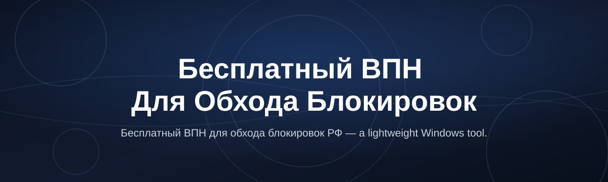

# vpn-ru-unblock-tool

*A no-cost Windows VPN app for people in Russia who need normal internet access back — no setup, no subscriptions.*

## What this is

vpn-ru-unblock-tool is a standalone Windows application that acts as a бесплатный ВПН для обхода блокировок РФ — meaning it routes your traffic through an outside server so sites and services restricted inside Russia load like they would anywhere else. There's no account system, no browser extension, and no monthly plan. You download one file, run it, and connect.

It exists because most VPN options aimed at this problem are either paid subscriptions with recurring billing, or browser plugins that stop working the moment a provider updates its filtering rules. This tool is built and maintained by one developer who uses it personally, so updates ship when the current unblocking method stops working — not on a quarterly release schedule.

  

The button opens the project's download page — that's where the current build lives.

## Who it is for

- **Students and researchers** who need access to academic databases, journals, or course platforms blocked at the ISP level.
- **Remote employees** whose company tools (Slack, certain cloud dashboards, dev platforms) are unreachable from a Russian IP.
- **People who want ordinary access to international news and social platforms** without switching browsers or installing extensions per-site.
- **Freelancers using foreign payment or contracting platforms** that are region-restricted.
- **Anyone on a personal Windows PC** who just wants "it works when I double-click it" instead of managing configs.

## What you can do

- **Connect in one click** — no sign-up screen, no email, no account to lose.
- **Reach services blocked at the ISP or DPI level** without touching browser settings.
- **Switch between a few server locations** if one is congested or slow.
- **Run it as a single .exe** — no installer, no Program Files clutter.
- **See a plain status indicator** for connected/disconnected — nothing dressed up as a dashboard.
- **Disconnect fully and instantly** — no lingering background service after you close it.
- **Use it next to your normal antivirus** without conflicts flagged as malware behavior.
- **Get quick patches** when a blocking method changes, since one person maintains it directly.

## Getting started

1. Open the download page using the button above.
2. Grab the latest Windows build (single `.exe`, no installer).
3. Run the file — Windows may show a SmartScreen prompt the first time; that's expected for unsigned indie tools.
4. Click **Connect** inside the app and wait for the status to turn green.
5. Open a browser and check that a previously blocked site now loads.

## Requirements

- Windows 10 or Windows 11, 64-bit.
- No Python, Node, or any toolchain — it's a compiled standalone app.
- Roughly 40 MB of free disk space.
- A working